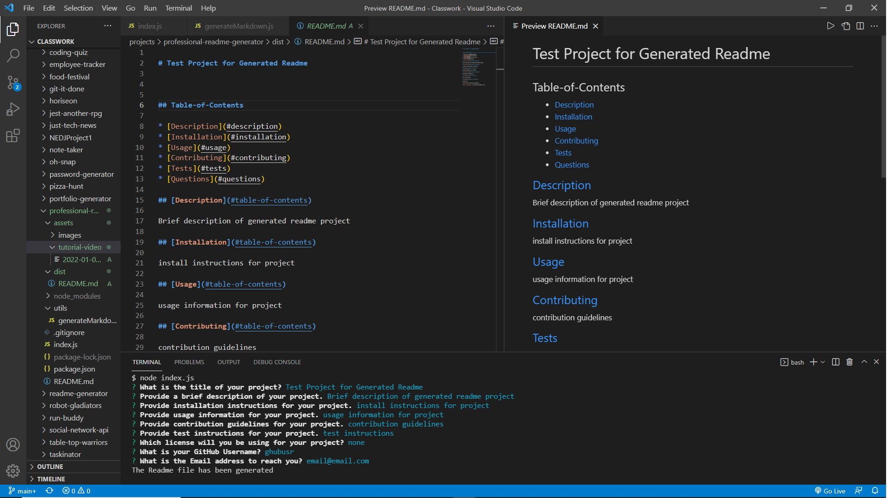

# Professional Readme Generator

[Github Repository](https://github.com/Ericcrain77/professional-readme-generator)

## Table of Contents
* [Description](#description)
* [User Story](#user-story)
* [Screenshot](#screenshot)
* [Tutorial](#tutorial)
* [Technologies](#technologies)
* [Questions](#questions)

## Description

An open source project in GitHub to generate professional looking Readme.md files after completeing a short prompt of questions.

## USER STORY

AS A developer

I WANT a README generator

SO THAT I can quickly create a professional README for a new project

## Screenshot

## Tutorial
[Tutorial Video](assets/tutorial-video/Challenge-9-Tutorial.mkv)

## Technologies
This application utilizes the following:
* Node.js

## Questions
Reach out to me using my [Github account](https://github.com/Ericcrain77) or my [email](ericcrain77@gmail.com).